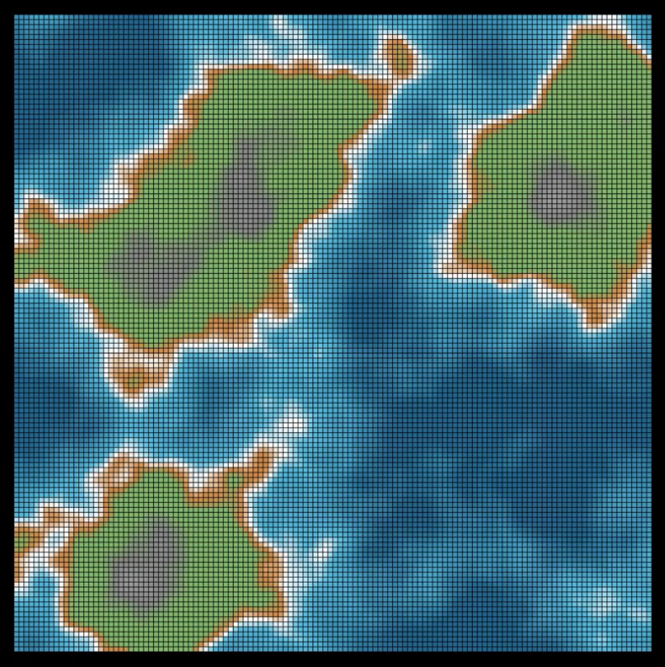

# vys
Python visualization

## Simple Scene

A simple experiment to see how to use Manim to create visualizations.

## Terrain Scene

A visualization of a terrain with different altitudes and colors.

